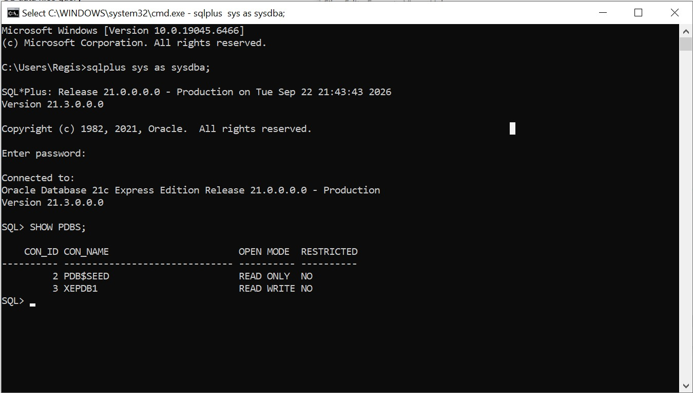
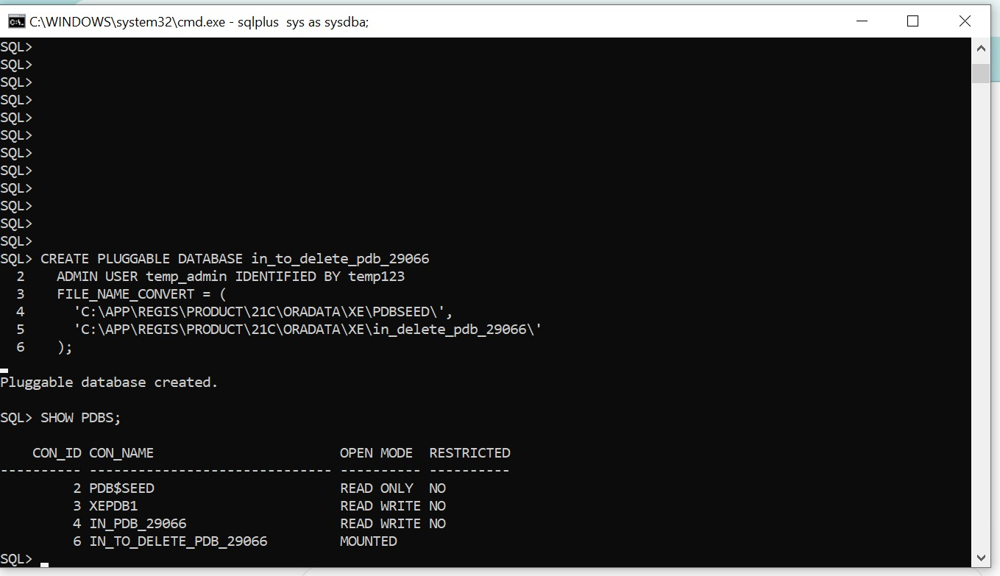
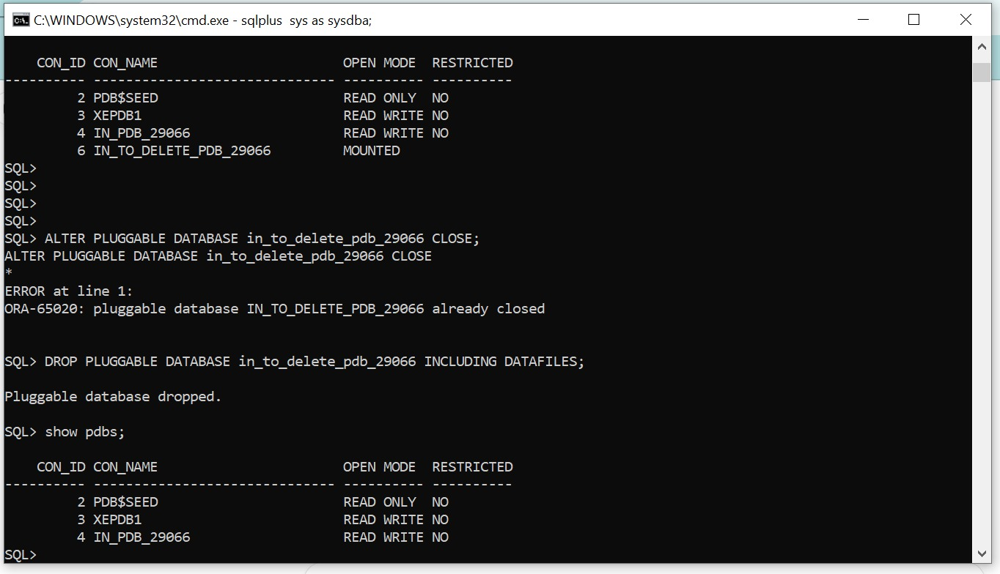
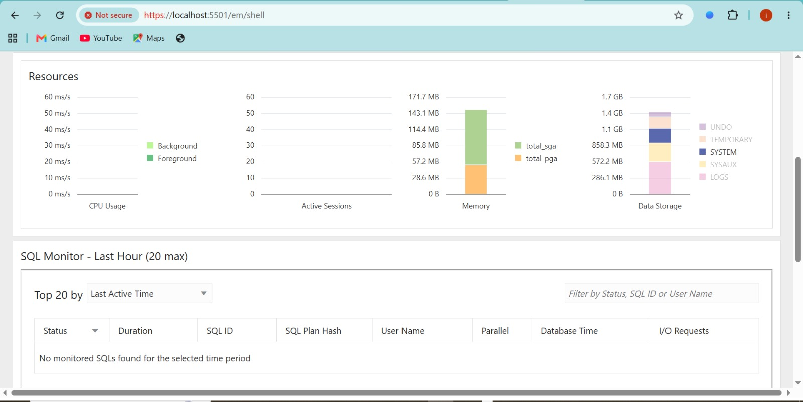

# Oracle Pluggable Database (PDB) Management — Assignment II

**Student name:** [your full name]
**Student ID:** [your ID]
**Course:** Database Development with PL/SQL (INSY 8311)
**Group:** [your group]

## Overview

This assignment covers the practical management of Oracle Pluggable Databases. I created a PDB and a user inside it, 
created and deleted a temporary PDB, accessed Oracle Enterprise Manager, and documented each 
task with screenshots and explanations.

## Oracle environment used

For this assignment, I used Oracle Database 21c Express Edition (21.3.0.0.0) installed locally on my Windows 
computer. I managed the Oracle database using SQL*Plus through the Windows Command Prompt, connecting with 
SYS AS SYSDBA to perform the required PDB management tasks.

## Task 1: Create a New Pluggable Database

I created a new Pluggable Database using the required naming convention. After creating the PDB, 
I opened it and created a database user inside the PDB. The user was created according to the 
required username format and will be used for future class work.

PDB name created: in_pdb_29066
Username created inside PDB: ineza_plsqlauca_29066

- **PDB name created:** in_pdb_29066
- **Username created inside PDB:** ineza_plsqlauca_29066

### Evidence

## Task 2: Create and Delete a PDB
What I Did

First, I created a temporary Pluggable Database (PDB) in Oracle using a temporary PDB name. 
After creating it, I checked the list of PDBs to verify that the new PDB was successfully 
created and existed in the database.

I then deleted the temporary PDB because it was only needed for this task. After deleting it, 
I checked the list of PDBs again to confirm that the temporary PDB was no longer available.

I successfully created a temporary PDB, verified that it existed, deleted it, and 
finally confirmed that it no longer existed in the Oracle database.

- **Temporary PDB name:** TEMP_PDB_29066

### Evidence

## Task 3: Oracle Enterprise Manager (OEM)

I accessed Oracle Enterprise Manager (OEM) through a web browser using the OEM URL 
provided for the Oracle database environment. After logging in with my database credentials, 
I opened the OEM dashboard.

The dashboard provides an overview of the Oracle database environment. It displays information 
such as the database status, availability, performance, storage, and other database activities. 
This dashboard helps me monitor the database and identify any issues or changes in its performance.

### Evidence

## Challenges faced and how I solved them

One challenge I experienced was having difficulty accessing the Oracle Enterprise Manager dashboard 
at first. I resolved the issue by checking that the Oracle database services were running and then 
refreshing the OEM page. After that, I was able to access the dashboard successfully.

## Integrity statement
I used AI to help me understand some parts of the assignment and organize my report. However, 
I did the practical work myself, including running the commands, testing the database, 
and checking the results. The work submitted is my own individual work.

## Submission details

- **Repository Link:** (https://github.com/kellybrazzy74-rgb/in_pdb_29066)
- **PDB Name Created:** in_pdb_29066
- **Issues Encountered:** [Yes/No]
